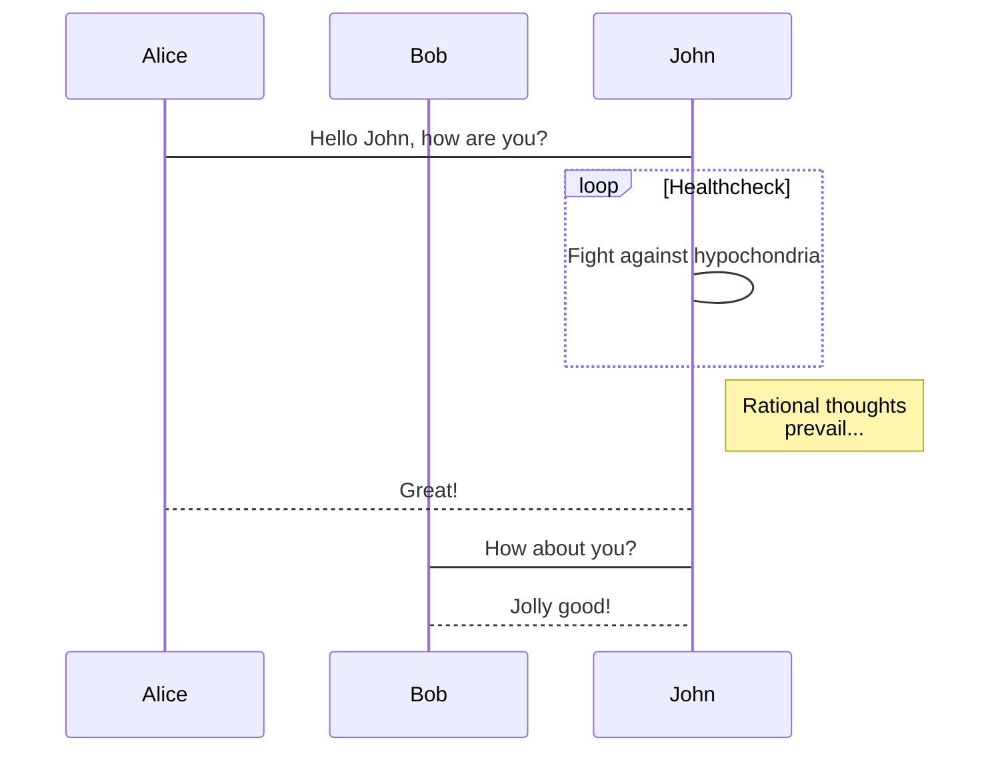

# Lorem ipsum

In [publishing](https://www.wikiwand.com/en/Publishing) and [graphic design](https://www.wikiwand.com/en/Graphic_design), **lorem ipsum** (derived from Latin *dolorem ipsum*, translated as "pain itself") is a [filler text](https://www.wikiwand.com/en/Filler_text) commonly used to demonstrate the graphic elements of a document or visual presentation. [^1]

## Example text

A common form of *lorem ipsum* reads:

> Lorem ipsum dolor sit amet, consectetur adipiscing elit, sed do eiusmod tempor incididunt ut labore et dolore magna aliqua. Ut enim ad minim veniam, quis nostrud exercitation ullamco laboris nisi ut aliquip ex ea commodo consequat. Duis aute irure dolor in reprehenderit in voluptate velit esse cillum dolore eu fugiat nulla pariatur. Excepteur sint occaecat cupidatat non proident, sunt in culpa qui officia deserunt mollit anim id est laborum.

----


Inline styles support **strong**, *Emphasis*, `code`, <u>underline</u>, ~~strikethrough~~, :haha:, $\LaTeX$, X^2^, H~2~O, ==highlight==, [Link](typora.io), and image:


Block level contains:

### Heading 3

#### Heading 4

##### Heading 5

###### Heading 6

| Left-Aligned  | Center Aligned  | Right Aligned |
| :------------ | :-------------: | ------------: |
| col 3 is      | some wordy text |         $1600 |
| col 2 is      |    centered     |           $12 |
| zebra stripes |    are neat     |            $1 |

1. ordered list item 1.
2. ordered list item 2.
   + sub-unordered list item 1.
   + sub-unordered list item 2.
     + [x] something is DONE.
     + [ ] something is not TODO.

```html
<!DOCTYPE html>
<html>
<body>

<h1>The *= Operator</h1>
  
<p id="demo"></p>

<script>
var x = 10;
x *= 5;
document.getElementById("demo").innerHTML = x;
</script>

</body>
</html>
```

[TOC]

[^1]: *Forked* from https://en.wikipedia.org/wiki/Lorem_ipsum


# 欢迎使用 iOS 版 MWeb

MWeb 是专业的 Markdown 写作、记笔记、静态博客生成软件，目前已支持 Mac，iPad 和 iPhone。MWeb 所使用的 Markdown 语法为 Github Flavored Markdown，简称 GFM，这是一种最为广泛使用的 Markdown 语法之一。如果你不知道什么是 Markdown，建议看一下附带的 [Markdown 语法官方说明](Markdown%20Syntax.md) 文档。GFM 除了支持官方的语法外，还扩展了不少语法。

## GFM 语法简介和 MWeb 所支持的扩展语法

### 回车转为换行

官方的语法规定结尾加 2 个以上空格加换行才会转成换行，也就是 `<br />` 标签。MWeb 中有个选项可以直接把换行转成 `<br />`，不用加上 2 个以上空格，这个选项默认是开启的。如果要关闭，请在设置页面关闭。

### 任务列表（Task lists）

Markdown 语法：

```
- [ ] 任务一 未做任务 `- + 空格 + [ ]`
- [x] 任务二 已做任务 `- + 空格 + [x]`
```

效果如下：

- [ ] 任务一 未做任务 `- + 空格 + [ ]`
- [x] 任务二 已做任务 `- + 空格 + [x]`

### 图片大小及对齐

官方和 GFM 都不支持图片大小控制及对齐设置，MWeb 引入的特别的语法来设置图片宽度和居左、居右、居中。如：`` 这样表示设置图片宽度为 450。其中 -w450 为设置语法，生成 HTML 时会自动移除。w 表示设置宽度，居左为：-l400，居右为 -r400，居中为 -c400，比如设置一图片宽度为 500 并居中：``。 可以看出，MWeb 引入的语法的特点是兼容原来的语法和仅支持设置宽度。

### 多行或者一段代码

Markdown 语法：

```javascript
function fancyAlert(arg) {
  if(arg) {
    $.facebox({div:'#foo'})
  }

}
```

效果如下：

```javascript
function fancyAlert(arg) {
	if(arg) {
		$.facebox({div:'#foo'})
	}

}
```

这个语法目前在 MWeb 中使用，必须前后空一行，才会正确解析。我觉得，在写 Markdown 文档过程中，运用空行很有必要，基本上，块级元素（标题、列表、引用、代码块、表格、段落等），都建议前后空一行。

### 表格

Markdown 语法：

```
第一格表头 | 第二格表头
--------- | -------------
内容单元格 第一列第一格 | 内容单元格第二列第一格
内容单元格 第一列第二格 多加文字 | 内容单元格第二列第二格
```

效果如下：

第一格表头 | 第二格表头
--------- | -------------
内容单元格 第一列第一格 | 内容单元格第二列第一格
内容单元格 第一列第二格 多加文字 | 内容单元格第二列第二格

### 删除线

Markdown 语法：

	加删除线像这样用： ~~删除这些~~

效果如下：

加删除线像这样用： ~~删除这些~~

### LaTeX

Markdown 语法：

	块级公式：
	```math
	x = \dfrac{-b \pm \sqrt{b^2 - 4ac}}{2a}
	```
	
	行内公式： ``\Gamma(n) = (n-1)!\quad\forall n\in\mathbb N``

效果如下（在设置页面中启用 LaTeX 才会看到效果）：

块级公式：

```math
x = \dfrac{-b \pm \sqrt{b^2 - 4ac}}{2a}
```

行内公式： ``\Gamma(n) = (n-1)!\quad\forall n\in\mathbb N``

注意：为了兼容 MWeb 3，也支持 $\Gamma(n) = (n-1)!\quad\forall n\in\mathbb N$ 
和块级语法
$$	x = \dfrac{-b \pm \sqrt{b^2 - 4ac}}{2a} $$
但是建议用新的语法。

## MWeb 画图

### mermaid

mermaid 是比较流行的画图库，它支持流程图、顺序图和甘特图，它的官网为：<https://mermaidjs.github.io/> ，在 MWeb 中使用 mermaid 的语法就是声明代码块的语言为 mermaid，代码块中再写上 mermaid 的画图语法即可，你可以把下面的语法复制到 MWeb 中查看效果。

    sequenceDiagram
        participant Alice
        participant Bob
        Alice->John: Hello John, how are you?
        loop Healthcheck
            John->John: Fight against hypochondria
        end
        Note right of John: Rational thoughts <br/>prevail...
        John-->Alice: Great!
        John->Bob: How about you?
        Bob-->John: Jolly good!

**效果如下：**



### 脚注（Footnote）

Markdown 语法：

```
这是一个脚注：[^1]
```

效果如下：

这是一个脚注：[^1]

[^1]: 这里是脚注信息


### 注释和阅读更多

<!-- comment -->
<!-- more -->

**注** 阅读更多的功能只用在文档库生成静态网站或发布到 Wordpress 博客时，插入时注意要后空一行。
