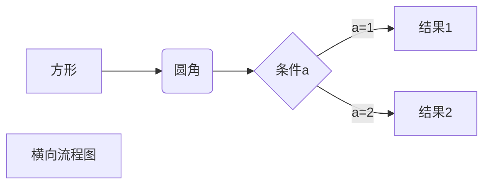
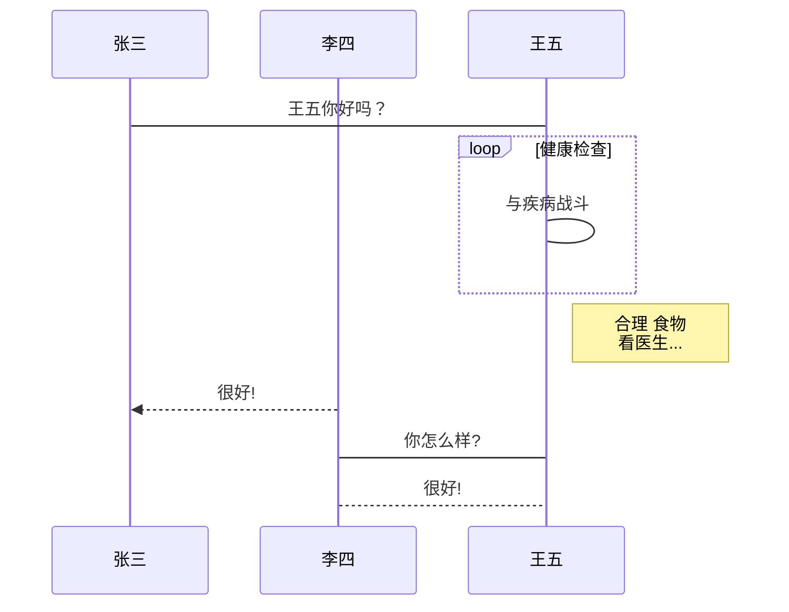
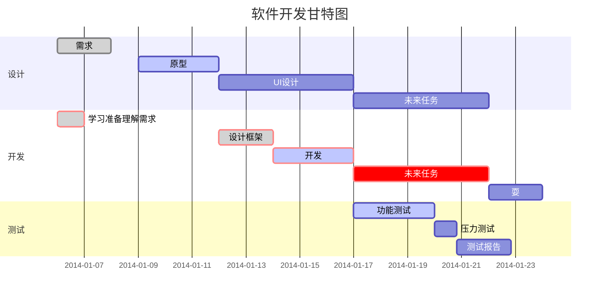

# GitHub Flavored Markdown Demo

Github Flavored Markdown，简称 GFM，这是一种最为广泛使用的 Markdown 语法之一。如果你不知道什么是 Markdown，建议看一下附带的 [Markdown 语法官方说明](https://github.github.com/gfm/)文档。GFM 除了支持官方的语法外，还扩展了不少语法。


## GFM 语法简介

### 目录

Markdown 语法：

```
[toc]
```

效果如下：

[toc]

### 回车转为换行

官方的语法规定结尾加 2 个以上空格加换行才会转成换行，也就是 `<br />` 标签。

### 代码块

Markdown 语法：

````
```python
print("Hello World")
```
````

效果如下：

```python
print("Hello world")
```

### 代码片段

Markdown 语法：

```
`print("Hello world")`
```

效果如下：

`print("Hello world")`

### 标题

Markdown 语法：

```
# 一级标题

## 二级标题

### 三级标题

#### 四级标题

##### 五级标题

###### 六级标题
```

效果如下：

# 一级标题

## 二级标题

### 三级标题

#### 四级标题

##### 五级标题

###### 六级标题

### 文字效果

Markdown 语法：

```
*斜体*
**加粗**
==高亮==
~~删除线~~
<u>下划线</u>
```

效果如下:

*斜体*
**加粗**
==高亮==
~~划线~~

<u>下划线</u>

### 有序列表

Markdown 语法：

```
1. 列表内容1
2. 列表内容2
   1. 缩进1
   2. 缩进2
```

效果如下：

1. 列表内容1
2. 列表内容2
   1. 缩进1
   2. 缩进2

### 无序列表

Markdown 语法：

```
- 列表内容1
- 列表内容2
  - 缩进1
  - 缩进2
    - 缩进3
    - 缩进4
```

效果如下：

- 列表内容1
- 列表内容2
  - 缩进1
  - 缩进2
    - 缩进3
    - 缩进4

### 任务列表

Markdown 语法：

```
- [ ] 任务一 未做任务
- [x] 任务二 已做任务
```

效果如下：

- [ ] 任务一 未做任务
- [x] 任务二 已做任务

### 水平分割线

Markdown 语法：

```
---
```

效果如下：

------

### 引用

Markdown 语法：

```
> 引用效果演示
>
> 引用效果演示
>
> > 嵌套引用效果演示
```

效果如下：

> 引用效果演示
>
> 引用效果演示
>
> > 嵌套引用效果演示

### 超链接

Markdown 语法：

```
[Markdown 语法官方说明文档](https://github.github.com/gfm/)
```

效果如下： 

[Markdown 语法官方说明文档](https://github.github.com/gfm/)

### 链接引用

Markdown 语法：

```
前往 [Google][1] 官网

[1]: https://www.google.com	"Google 官网"
```

效果如下：

前往 [Google][1] 官网

[1]: https://www.google.com	"Google 官网"

### 脚注

Markdown 语法：

```
Markdown 脚注[^1] 的演示。

[^1]: 附在文章页面的最底端的，对某些东西加以说明，印在书页下端的注文。
```

效果如下：

Markdown 脚注[^2] 的演示。

[^2]: 附在文章页面的最底端的，对某些东西加以说明，印在书页下端的注文。

### 图片

Markdown 语法：

```

```

效果如下：


### 表格

Markdown 语法：

```
| Left-Aligned  | Center Aligned  | Right Aligned |
| :------------ |:---------------:| -----:|
| col 3 is      | some wordy text | $1600 |
| col 2 is      | centered        |   $12 |
| zebra stripes | are neat        |    $1 |
```

效果如下：

| Left-Aligned  | Center Aligned  | Right Aligned |
| :------------ | :-------------: | ------------: |
| col 3 is      | some wordy text |         $1600 |
| col 2 is      |    centered     |           $12 |
| zebra stripes |    are neat     |            $1 |

### LaTeX

Markdown 语法：

	行内公式演示：$\int \frac{1}{x} \, \mathrm{d}x = \ln \left| x \right| + C$
	
	行间公式演示：
	$$
	\mathbf{V}_1 \times \mathbf{V}_2 =  \begin{vmatrix}
	\mathbf{i} & \mathbf{j} & \mathbf{k} \\
	\frac{\partial X}{\partial u} &  \frac{\partial Y}{\partial u} & 0 \\
	\frac{\partial X}{\partial v} &  \frac{\partial Y}{\partial v} & 0 \\
	\end{vmatrix}
	$$

效果如下：

行内公式演示：$\int \frac{1}{x} \, \mathrm{d}x = \ln \left| x \right| + C$

行间公式演示：
$$
\mathbf{V}_1 \times \mathbf{V}_2 =  \begin{vmatrix}
\mathbf{i} & \mathbf{j} & \mathbf{k} \\
\frac{\partial X}{\partial u} &  \frac{\partial Y}{\partial u} & 0 \\
\frac{\partial X}{\partial v} &  \frac{\partial Y}{\partial v} & 0 \\
\end{vmatrix}
$$

## 画图

### mermaid 流程图

mermaid 是比较流行的画图库，它支持流程图、顺序图和甘特图，它的官网为：<https://mermaidjs.github.io/> 。

Markdown 语法：

````

````

效果如下：


### mermaid UML 标准时序图

Markdown 语法：

````

````

效果如下：


### mermaid 甘特图

Markdown 语法：

````

````

效果如下：


### flow 流程图

Markdown 语法：

````
```flow
st=>start: 开始框
op=>operation: 处理框
cond=>condition: 判断框(是或否?)
sub1=>subroutine: 子流程
io=>inputoutput: 输入输出框
e=>end: 结束框
st(right)->op(right)->cond
cond(yes)->io(bottom)->e
cond(no)->sub1(right)->op
```
````

效果如下：

```flow
st=>start: 开始框
op=>operation: 处理框
cond=>condition: 判断框(是或否?)
sub1=>subroutine: 子流程
io=>inputoutput: 输入输出框
e=>end: 结束框
st(right)->op(right)->cond
cond(yes)->io(bottom)->e
cond(no)->sub1(right)->op
```

### sequence UML 时序图

Markdown 语法：

````
```sequence
对象A->对象B: 对象B你好吗?（请求）
Note right of 对象B: 对象B的描述
Note left of 对象A: 对象A的描述(提示)
对象B-->对象A: 我很好(响应)
对象A->对象B: 你真的好吗？
```
````

效果如下：

```sequence
对象A->对象B: 对象B你好吗?（请求）
Note right of 对象B: 对象B的描述
Note left of 对象A: 对象A的描述(提示)
对象B-->对象A: 我很好(响应)
对象A->对象B: 你真的好吗？
```

